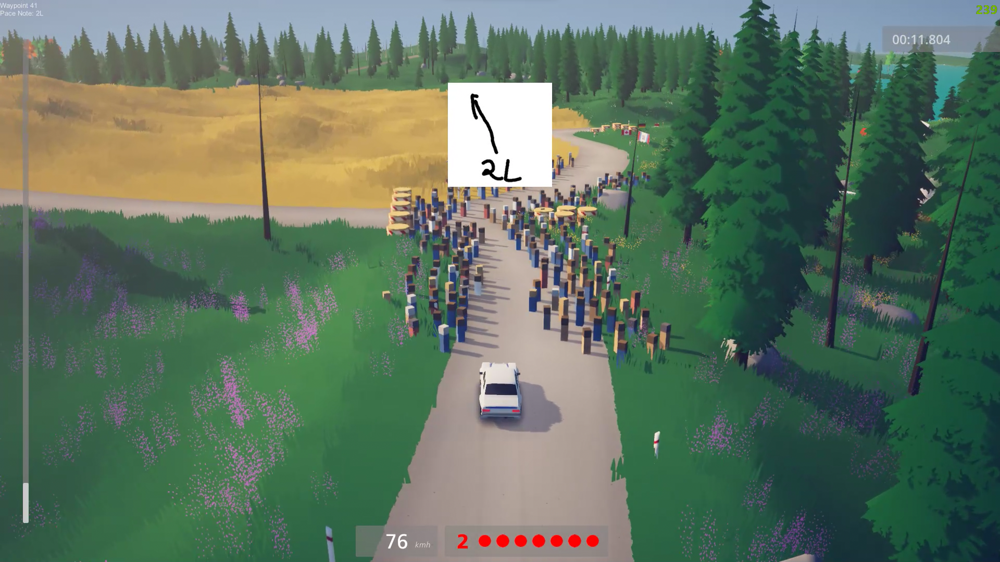

# Art Of Rally Pace Notes

[](https://github.com/Theaninova/ArtOfRallyPacenotes/releases/latest)

[](https://discord.gg/Sx3e7qGTh9)

A mod for Art Of Rally that adds automatic & configurable pace notes.

#### Launcher Support


#### Platform Support


***If you created an asset set or pacenotes and want to share it,
please either message me or submit a merge request to the `presets/` folder.***

## Usage

Press `CTRL + F10` to bring up the mod menu. Click on the Pace Notes mod,
and enable or disable the desired features.

### Features

* Pace notes!
* Custom asset sets
* Custom pace note configuration

### Folder Structure

```
mod root/
├─ PaceNoteAssets/
│  ├─ default/
│  │  ├─ 1R.png
│  │  └─ ...
│  └─ yourCustomAssets/
│     ├─ 1R.png
│     └─ ...
├─ PaceNoteConfigs/
│  ├─ default/
│  │  ├─ finland_noormarkku.csv
│  │  └─ ...
│  └─ yourCustomPaceNotes/
│     ├─ finland_noormarkku.csv
│     └─ ...
├─ ArtOfRallyPaceNotes.dll
└─ info.json

```

### Writing Pace Notes

First, enable the "Show Current Waypoint" setting in the options.

In principle, you could use any names for your pace notes, but
for the sake of consistency, we are going to use the Patterson "Numbers" system
for naming.

[](https://www.rallynews.net/pattersonpacenotes/systemtypes.asp)

This does *not* mean that they will be displayed like this, that will be up to
the asset set you use.

Pace Notes are written as a [CSV](https://en.wikipedia.org/wiki/Comma-separated_values) file,
with the following columns:

| Start Waypoint | End Waypoint | Pace Note |
|----------------|--------------|-----------|
| 0              | 10           | 1R        |
| 20             | 30           | AcR       |
| ...            | ...          | ...       |

Which would be the equivalent of

`area_stage.csv`
```csv
0,10,1R
20,30,AcR
...,...,...
```

This means from waypoint 0..10, you will see the pace note for 1R.

Please also refer to the included files for more info on how to create them.

### Adding assets

Honestly, not sure which image formats are supported beside PNG, just try.

For adding them simply paste the files into the `PaceNoteAssets/yourCustomAssets`
folder, set the "Asset Set" option to "yourCustomAssets", and click "Save".

Your files should be named according to the Patterson "Numbers" system, but
if you want feel free to use any name you want. Just be aware that the names
have to correspond to the ones in the CSV file. There are no further
restrictions imposed.

***Naming is purely a recommendation from someone
who doesn't really know shit about this.***

## Installation

Follow the [installation guide](https://www.nexusmods.com/site/mods/21/) of
the Unity Mod Manager.

Then simply download the [latest release](https://github.com/Theaninova/Art-Of-Rally-Reset-Pacenotes/releases/latest)
and drop it into the mod manager's mods page.

## Showcase

[**Demo Video:**](https://www.youtube.com/watch?v=2-Leem4fPRk)

[](https://www.youtube.com/watch?v=2-Leem4fPRk)
